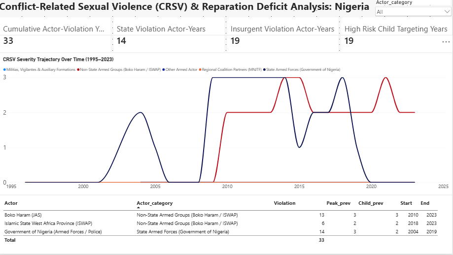

# Conflict-Related Sexual Violence (CRSV) & Reparation Deficits in Nigeria: An Empirical Policy Assessment (1995–2023)

**Author:** Sayemo Harris  
**Date:** October 2026  
**License:** Code: MIT License | Documentation & Analysis: CC BY 4.0  

---

## Executive Summary

This project provides an empirical evaluation of Conflict-Related Sexual Violence (CRSV) in Nigeria over a 28-year period (1995–2023). Using standardized, long-term conflict data from the SVAC dataset, the analysis tracks documented violation frequency, severity patterns, and the lack of accessible victim compensation across both government security forces and non-state insurgent groups.

### Key Analytical Findings

* **Combined Years of Documented Abuse (33 Actor-Years):** Between 1995 and 2023, armed actors in Nigeria recorded a combined total of 33 actor-years of sexual violence. Because state forces and insurgent groups operated at the same time during intense phases of conflict, this number counts each group’s recorded actions separately, rather than 33 individual calendar years.
* **Documented State Security Force Involvements (14 Actor-Years / 42.4%):** Government security forces (incorporating military formations and police commands) account for 14 recorded actor-years of violations between 2004 and 2019. Because the state carries legal duties under national and international law to protect citizens and safeguard human rights, these findings highlight the state's responsibility to deliver administrative reparations and ensure structural guarantees of non-recurrence.
* **Protracted Insurgent Severity (19 Actor-Years / 57.6%):** Non-state armed groups—specifically Boko Haram (JAS) and the Islamic State West Africa Province (ISWAP)—demonstrate sustained violations, maintaining peak systematic severity (Level 3) continuously through 2023.
* **Severe Prevalence Involving Children (19 Actor-Years):** In 19 actor-years, documented violence against children reached massive or systematic proportions (prevalence score ≥ 2). This highlights an urgent need for multi-generational healthcare, schooling support, and legal identity documentation for affected families.
* **The Gap in Support for Survivors:** Even though the data shows decades of widespread harm, survivors have no viable path to victim compensation. In reality, there is no framework in place for victim compensation—whether an attacker is convicted in court or not. Individual fighters are largely unidentified, deceased, or dispersed in remote bush areas, making civil recovery impossible. At the same time, counter-terrorism trials and military dockets focus strictly on state security offenses, offering zero restitution or financial remedy to victims. As a result, thousands of survivors receive zero urgent medical care, specialized fistula repair, or trauma counseling. Dedicated, non-judicial administrative reparations are urgently required to close this gap.

---

## Comparative Longitudinal Findings

| Actor Name | Analytical Category | Documented Violation Years | Peak Severity (0–3) | Peak Child Prevalence (0–3) | Documented Active Horizon |
| :--- | :--- | :---: | :---: | :---: | :---: |
| **Boko Haram (JAS)** | Non-State Armed Groups | 13 | 3 (Systematic) | 3 (Systematic) | 2010 – 2023 |
| **Islamic State West Africa Province (ISWAP)** | Non-State Armed Groups | 6 | 2 (Massive) | 2 (Massive) | 2018 – 2023 |
| **Government of Nigeria (Armed Forces / Police)** | State Armed Forces | 14 | 3 (Systematic) | 2 (Massive) | 2004 – 2019 |
| **Cross-Conflict Aggregation** | **Combined Profile** | **33** | **3** | **3** | **1995 – 2023** |

---

## Core Quantitative Architecture

* **Cumulative Actor-Violation Years (All Actors):** **33 actor-years**
  * **State Documented Exposure Share:** **14 actor-years** (42.4%)
  * **Insurgent Exposure Share (JAS / ISWAP):** **19 actor-years** (57.6%)
* **High-Risk Child Targeting Exposure (Prevalence ≥ 2):** **19 actor-years**

> **Methodological Note on Units:** *Cumulative Actor-Violation Years (33)* measures aggregated institutional exposure across distinct armed entities (14 State + 19 Insurgent). In calendar years where both statutory armed forces and insurgent groups committed documented violations simultaneously, each entity accumulates an autonomous actor-year observation in the dataset, providing an empirical foundation for assessing state and non-state responsibility.

---

## Practical Policy Recommendations

1. **Establish a Standardized, Survivor-Led Registration System:**
   * Partner with local survivor networks and civil society organizations to design secure, trauma-informed intake procedures.
   * Provide comprehensive assistance covering financial and material support, specialized fistula and medical surgery, trauma counseling, and legal identity documentation and schooling support for children born of war.

2. **Set Up an Administrative Reparations Board:**
   * Decouple victim compensation and survivor care from criminal courtroom dockets. The Federal Government and Northeast state authorities should establish an administrative reparations fund to deliver direct material relief, healthcare vouchers, and stabilization grants without waiting for perpetrator trials or peace settlements.

3. **Incorporate Survivor Support into Regional Security & Peace Frameworks:**
   * Integrate structured victim consultation and compensation mechanisms into ongoing Disarmament, Demobilization, and Reintegration (DDR) and transitional justice programs in Northeast Nigeria to ensure assistance aligns directly with survivor priorities.

4. **Ensure Guarantees of Non-Recurrence:**
   * Grounded in the 14 documented violation years involving statutory security forces, institute clear security sector reforms by embedding enforceable human rights codes into operational rules of engagement and establishing independent oversight units.

---

## Repository Structure

* **`01_RAW_DATA/`**
  * `SVAC_3.3_complete.xlsx`
* **`02_PROCESSED_DATA/`**
  * `CRSV_Nigeria_Clean_Analytical_Dataset.csv`
  * `CRSV_Nigeria_Actor_Profile_Summary.csv`
* **`03_SCRIPT/`**
  * `CRSV_Nigeria_Reparations_Analysis.ipynb`
* **`04_VISUALIZATION/`**
  * `CRSV_Nigeria_Reparations_Dashboard.pbix`
  * `CRSV_Nigeria_Reparations_Dashboard.pdf`
* **`05_DOCUMENT/`**
  * `Conflict_Related_Sexual_Violence_Nigeria_Assessment_report.pdf`
  * `CRSV_Nigeria_Policy_Advocacy_Brief_v1_2.pdf`
  * `CRSV_Nigeria_Executive_Briefing_Deck_v1_1.pptx`
* **`README.md`**

---

## Data Provenance, Methodology & Attribution

The quantitative metrics in this study are derived from the **Sexual Violence in Armed Conflict (SVAC)** dataset:
* **Source:** Peace Research Institute Oslo (PRIO), University of Gothenburg, and Harvard Kennedy School.
* **Core Dataset:** SVAC Actor-Year Dataset (Version 3.3).
* **Citation:** Cohen, Dara Kay, and Ragnhild Nordås. *Sexual Violence in Armed Conflict (SVAC) Dataset*. Peace Research Institute Oslo (PRIO) & Harvard Kennedy School.
* **Primary Documentation Streams:** Triangulated monitoring from UN Secretary-General Annual Reports, US State Department Country Reports on Human Rights Practices, and reporting from Amnesty International and Human Rights Watch.
* **Licensing:** Source dataset distributed under PRIO/Harvard open-access academic terms. Repository analytical scripts and data models are licensed under the [MIT License](LICENSE). The written reports, policy briefs, and derived findings are licensed under the [Creative Commons Attribution 4.0 International (CC BY 4.0)](https://creativecommons.org/licenses/by/4.0/) License.
* **Project Adaptation Citation:**
  > **Harris, Sayemo.** *Conflict-Related Sexual Violence (CRSV) & Reparation Deficits in Nigeria: An Empirical Policy Assessment (1995–2023)*. Analytical Dashboard & Policy Brief, 2026. Repository: https://github.com/harrissayemo-oss/crsv-nigeria-reparations-analysis
